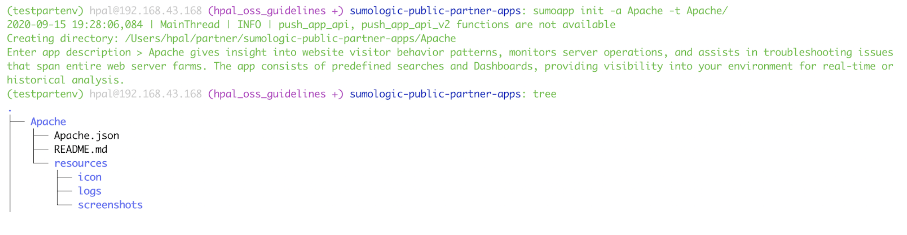
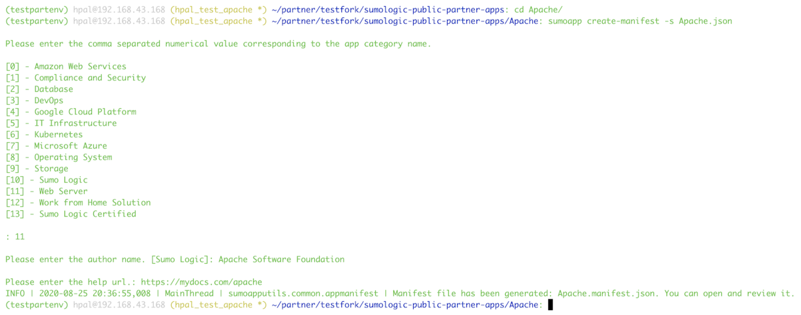
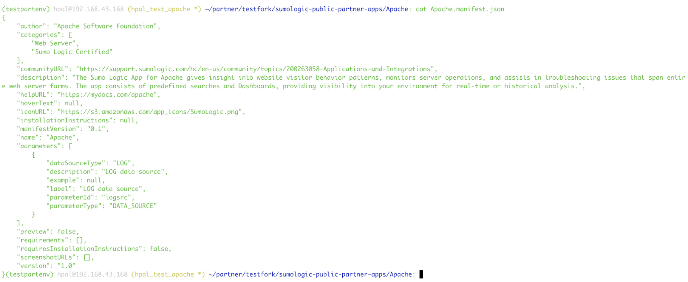
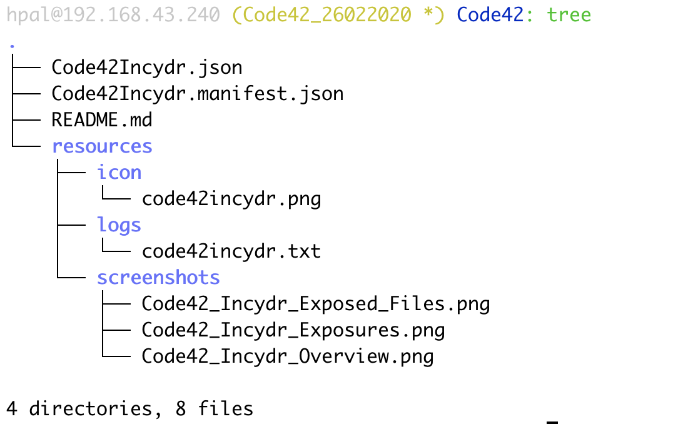
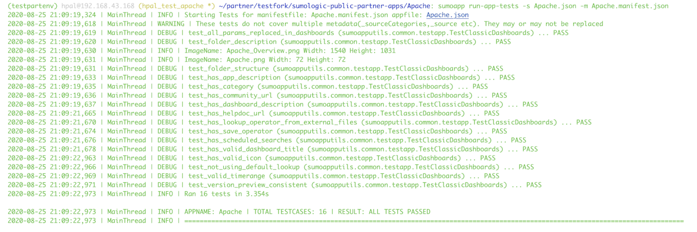
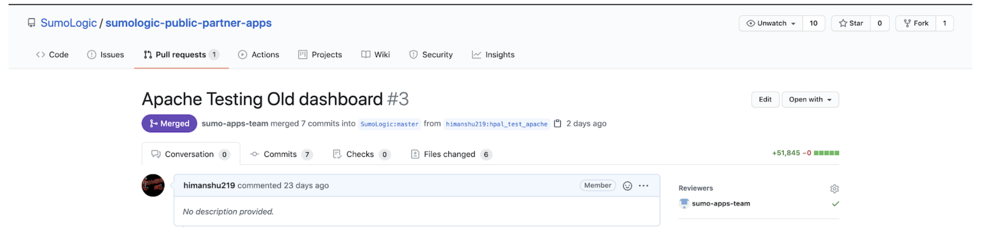
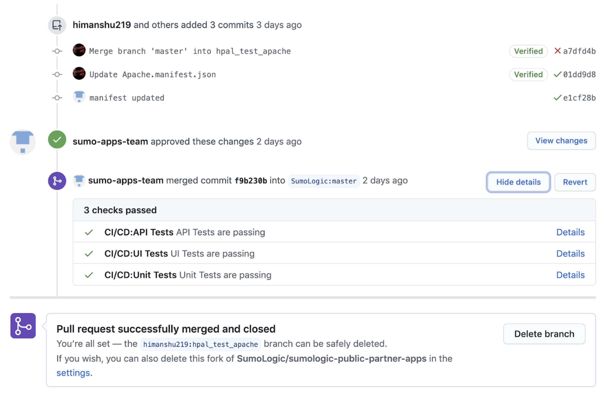

# Contributing Guide

First of all, thanks for contributing!

## Reporting Issues

  - If you have a feature request or an issue for Sumo Logic portal, you should contact [support](support@sumologic.com) so the request can be properly tracked.

  - If you think you've found an issue with the app or [sumoapp CLI tool](https://pypi.org/project/sumologic-apptestutils/), you can open a Github issue.

  - Feel free to reach out to us at sumodojo.slack.com.

## App Development Process

To contribute you will need to ensure you satisfy the following prerequisites:

   -  You have a working [Python 3 environment](https://docs.python.org/3/using/index.html) with [pip](https://pip.pypa.io/en/stable/installing/) installed.
   -  You have a working [Git CLI](https://help.github.com/en/github/getting-started-with-github/set-up-git#setting-up-git).
   -  You have access to Sumo Logic portal.

If you are a new user of Sumo Logic you can look into the [Resources](#Resources) section below for getting up to speed with the query language used in panels.

You can develop a new app or make changes to the app's dashboards in your Sumo Logic portal. Sumo Logic recommends the best app development practices mentioned in these docs - [Classic Dashboards](AppDevelopmentBestPractices.pdf) and [New Dashboards](App Development - Best Practices(New Dashboards).pdf).
After you are satisfied with your changes you can follow below steps to publish your changes.

### Phase 1. Get App artifacts ready:

1. Put all app resources (e.g searches, dashboards) in a top-level folder in the Sumo Logic console.Make sure all the dashboards and the top-level folder have the description field filled in (before exporting to JSON).
2. Export the JSON of the top-level app folder. Even if your app has 1 resource like a dashboard, you need to put it in a folder then export that folder.Instructions on how to export are [here](https://help.sumologic.com/05Search/Library/Export-and-Import-Content-in-the-Library).
3. Use this [template](https://docs.google.com/document/d/1Ae9nG--GXo0nkdCNMZIRZIuhCXwJyHvvAwe2Upc6kRo/edit) to create the docs. Host the docs and get a publicly accessible link (not password protected) as it will be made available in the Sumo Logic App Catalog as helpURL when customers click on the app. Also, it will be linked to from the [Sumo Logic DocHub](https://help.sumologic.com/07Sumo-Logic-Apps/Partner_Ecosystem_Apps).
4. Get a logo (Icon is 72x72px png on a transparent background).
5. Capture hi-resolution screenshots of all dashboards.
6. Get a text file with sample log messages that can light up dashboards (use [the export search results feature](https://help.sumologic.com/05Search/Get-Started-with-Search/Search-Basics/Export-Search-Results).)

    **_NOTE:_** - Maximum file size limit is 5 MB for each screenshot and icon file. For sample log file size limit is 10 MB. Also all the content in the resources folder should not exceed 100 MB.

7. Decide on Application Categories corresponding to your app (1-3 or more of: Amazon Web Services, Compliance and Security, DevOps, Google Cloud Platform, Kubernetes, Microsoft Azure)

### Phase 2: Setting up GitHub.

If you are doing app development for first time then follow the below steps for setting up the repo else go to the next phase.In this phase, you will fork Sumo Logic’s public app repository that will allow you to collaborate with the Sumo Logic Apps team.You will also install the [sumoapp CLI tool](https://pypi.org/project/sumologic-apptestutils/) for running the unit tests.

1. Navigate to the https://github.com/SumoLogic/sumologic-public-partner-apps
2. In the top-right corner of the page, click Fork
3. Pull the GitHub repository locally on your computer using the following command

        git clone https://github.com/<owner>/sumologic-public-partner-apps.git

4. Install the sumo logic CLI tool using the following command

        pip3 install sumologic-apptestutils

   To upgrade the CLI tool run below command

        pip install --upgrade sumologic-apptestutils

5. Ensure that the client is installed by running the following help command

        sumoapp -h

6. To support tabbing run the following command

       sumoapp enableautocomplete

### Phase 3. Pushing app code & artifacts to the GitHub repository

In this phase we will commit exported json, run unit test, push the code to a git branch and create a PR for review.

1. Change directory to the cloned repository created in Phase 2 Step 3.

    **_NOTE:_** - All the CLI commands in the next steps should be run inside the directory.

2. Create a new branch by using the following command.

        git checkout -b <appname_ddMMyyyy>

    **_NOTE:_** - Use camelcase without spaces for App name; and if it’s longer than 10 characters then truncate it as you feel.

3. Run the following command; replace *My_App* with Sumo Logic App Name and *Folder* with the app folder name. In general folder names should not contain spaces or any special characters.

        sumoapp init -a <My_App> -t <Folder>

    On *“Enter app description”* prompt provide the brief description of your app.
    This will be automatically added in your app’s Readme.md file.This will create the required folder structure for the repository.

    

   **_NOTE:_** - You may also see testlogs folder which is the logs directory for the cli tool which you don’t need to include in your commits.

4. Go to your app folder. Replace the empty JSON file (MyApp.json) in the current directory with the exported JSON in step 1.2.

5. Run the following command to generate the Manifest file (MyApp.manifest.json). This will be generated in the current folder. This file contains meta-data about the Sumo Logic Partner App.

        sumoapp create-manifest -s <Myapp>.json

    On prompt, Provide the number corresponding to the category name (comma separated in case of multiple categories), help URL and author for your app from phase 1.

    

    To update the manifest run the below command.

        sumoapputils update-manifest -s <exported json filepath> -m <file path to manifest.json>

6.  Open the manifest in txt editor and review it to make sure every field is right, especially values for field *“categories”, “author” and “name”*

    **_NOTE:_** - If there are multiple source categories, please make sure that all queries reflect the correct source category. For example,  _sourceCategory=System/AppSource1, _sourcecategory = System/AppSource1, _sourceCategory = system/appsource1,  _sourceCategory = "System/AppSource1" will generate single input source parameter while  _sourceCategory = System/AppSource1 and _sourceCategory = System/AppSource2 will generate 2 separate input source parameters.

    

7. Go to the resources/icon folder and add a logo (Icon is 72x72px png on a transparent background).
8. Go to the resources/screenshots folder and add hi-resolution screenshots of all dashboards.
9. Go to the resources/logs folder and add a sample log file(with .txt .json .csv or .xml) with sample log messages (use the [export search results feature](https://help.sumologic.com/05Search/Get-Started-with-Search/Search-Basics/Export-Search-Results)).

    After adding the above artifacts you should have a folder structure as shown below.

    

10. Run unit tests locally with the below command.

        sumoapp run-app-tests -s <exported json filepath> -m <file path to manifest.json>

    You should see **RESULT: ALL TESTS PASSED** as shown below. If not, read the Error message and fix the issue(s).

    

11. Push the changes to the new branch created in step 3.2 and create a PR for triggering ci/cd pipeline.

        git add Myapp.json Myapp.manifest.json resources/
        git commit -m “Sumo-<appname>: first checkin“
        git push origin --set-upstream Myapp_26022020

    **_NOTE:_** - Myapp_26022020 is the branch name created in step 3.2

12. Now go to your forked repository in Github and follow the instructions in this [doc](https://docs.github.com/en/github/collaborating-with-issues-and-pull-requests/creating-a-pull-request-from-a-fork) to create a pull request to the https://github.com/SumoLogic/sumologic-public-partner-apps (from where you forked your repo).

### Phase 4. Review and approval phase with the Sumo Logic Apps team.

1. After all the tests are passed, from your GitHub pull request .Add **sumo-apps-team** user as reviewer

   

2. The AppDev team member puts review comments.
3. Partner app developer makes changes and pushes it to GitHub by repeating steps in phase 3.
4. After **sumo-apps-team** user gives approval and all the tests are passing you can merge the branch to master.

    

5. Sumo Logic will push the app to all deployments with the earliest release schedule.

## Resources

- [Search CheetSheets](https://help.sumologic.com/05Search/Search-Cheat-Sheets)
- [Community Query Library](https://support.sumologic.com/hc/en-us/community/topics/200396738-Query-Library)
- [Hands on Labs](https://help.sumologic.com/01Start-Here/Quick-Start-Tutorials)
- [Search Query Language](https://help.sumologic.com/Search/Search-Query-Language)
- [App Development Best Practices for Classic Dashboards](AppDevelopmentBestPractices.pdf)
- [App Development Best Practices for New Dashboards](App Development - Best Practices(New Dashboards).pdf)

