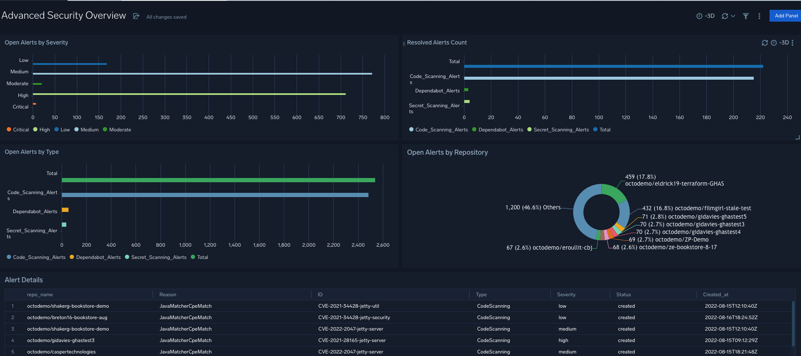
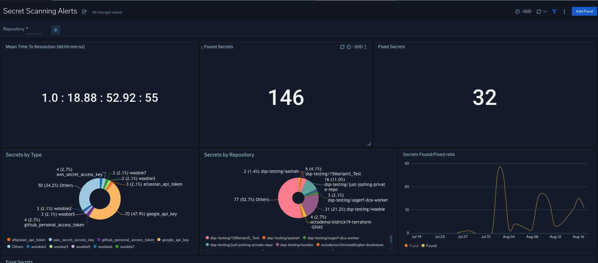
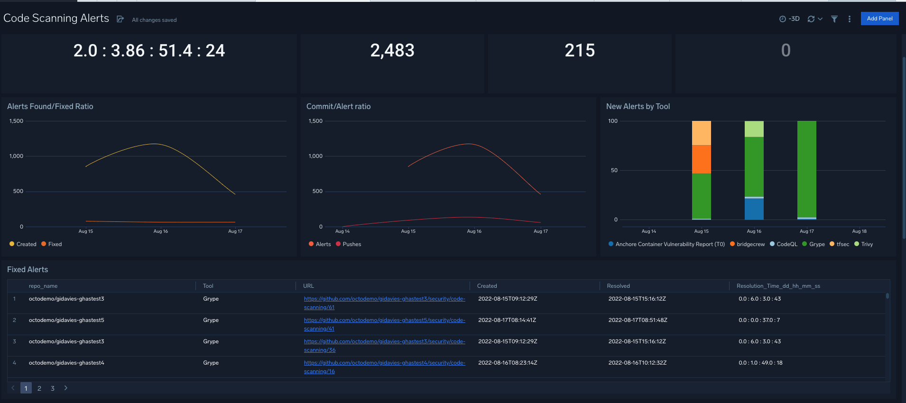

# GitHub App for Sumo Logic

**This application has been developed and is supported by GitHub. In case of technical questions, please contact GitHub support at partnerships@github.com.**

## Product Description: 
### App description: 
The GitHub App for GHAS provides a series of dashboards that display GHAS alerts and helps any organization improve its security posture by increasing the visibility of application security events.


| **Dashboards** | **Description** |
| --- | --- |
| Advanced Security overview | The dashboard provides an overview of GHAS metrics across Dependabot, secret scanning and code scanning alerts |
| Code Scanning Alerts | The dashboard provides a granular overview of the code scanning alerts |
| Dependabot Alerts | The dashboard provides a granular overview of the Dependabot alerts |
| Secret Scanning Alerts| The dashboard provides a granular overview of the secret scanning alerts |


### Sample Log Message
```
"Secret","_count"
"aws_secret_access_key","3"
"rsa_private_key","1"
"google_api_key","43"
"github_personal_access_token","2"
"mailgun_api_key","1"
"terraform_api_token","1"
"azure_devops_personal_access_token","2"
"stripe_api_key","1"
"aws_access_key_id","3"

```
### Query sample 
```
_source="GitHub" 
| where action in ("created") 
| json "alert.secret_type", "alert.html_url" , "repository.full_name" as Secret, URL, repo_name
| count by Secret
```

## Collect Logs for GitHub
TBD

## Get Started
TBD

### Advanced Security Overview
This dasboard provides an overview of all code scanning, Dependabot and secret scanning alerts across your organization's repositories. It includes the following views:

* Open alerts by severity
* Resolved alerts count
* Open alerts by type
* Open alerts by repository
* Alerts details

### Screenshot


<hr>

### Secret Scanning Alerts
The dashboard provides a granular overview of the secret scanning alerts. It includes the following views:

* Mean Time to Resolution (average aggregate resolution time)
* Found secrets
* Fixed secrets
* Secrets by type
* Secrets by repository
* Secrets found/fixed ratio

### Screenshot


<hr>

### Code Scanning Alerts
The dashboard provides a granular overview of the code scanning alerts. It includes the following views:

* Mean Time to Resolution (average aggregate resolution time)
* Created
* Fixed
* Reopened
* Alerts found/fixed ratio
* Commit/alert ratio
* New alerts by tool
* Alerts by severity 
* Alerts by repo 

### Screenshot


<hr>

### Dependabot Alerts
The dashboard provides a granular overview of the Dependabot alerts. It includes the following views:

* Mean Time to Resolution (average aggregate resolution time)
* Created
* Fixed
* Dismissed
* Alerts found/fixed ratio
* Vulnerabilities by repo
* New alerts by repo


### Screenshot


