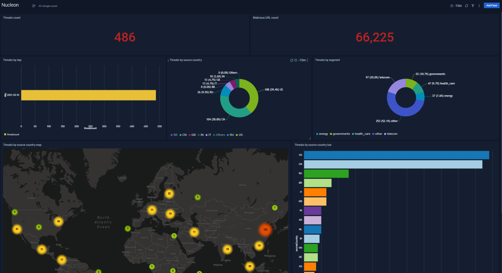

<!--  -->

<p align="center">  </p>

# Nucleon Cyber app for Sumo Logic

- [Introduction](#Introduction)
- [Installation](#Installation)
- [Dashboard](#Dashboard)
- [LogMessage](#LogMessage)
- [Screenshots](#Screenshots)
- [Support](#Support)

# Introduction

Nucleon learns about the external threat landscape in order to determine how threats can
impact your security posture. Nucleon delivers notifications for pre-attack adversary behaviour, empowering you to truly protect your network. As part of its core functions, the Nucleon polymorphic sensors identify impending threats before impact, automating these early-warnings effectively.

With our active threat feeds and robust client integrations, these all equal early threat
detection and visibility, and increased protection. An additional set of these polymorphic sensors sit closer to the gateways of your network, collecting data about sensitive and vulnerable access points that are unique to your network specifically.
They expand your attack surface in order to lure in and potentially trap those
bad actors.

We provide only actionable alerts, actively guiding you to block the attack source with the help of your existing defense systems. From the Nucleon dashboard, you can access threat intelligence assessments, threat alerts, insights and remediation guidance that contribute to a strengthened security posture.

The process is described in detail. For any questions or concerns please contact us through
your Slack channel or at Support@nucleon.sh

# Collect Logs for Nucleon
1. Go to SumoLogic home page, and press on ***Setup Wizard***.
2. Move the cursor to ***Start streaming data to Sumo Logic*** and press on ***Get Started***
3. Select the following : ***All other Sources***
4. go to  ***HTTPS Source***
5. Chose a source category and hit next
6. copy the URL and send it to Nucleon Cyber (support@cnucleon.sh)

# Install the Nucleon App and View the Dashboards

This page has instructions for installing the Sumo Logic App for Nucleon and descriptions of each of the app dashboards.

Use the instruction from this doc (https://help.sumologic.com/05Search/Library/Apps-in-Sumo-Logic/Install-Apps-from-the-Library) to install the Nucleon App.

**Dashboard Name**: Nucleon

**Dashboard Description**: Nucleon is a distributed, high-performance invisible and non-invasive platform that is tailored to secure environments from different common threats such as professional hacking groups, APTs and others. Our platform identifies what your adversaries are doing, how they’re doing it and whether they’re targeting you or your extended enterprise. Our platform enables clients to have high quality intelligence feeds with 0% false positive!. This is the first version of ActiveThreats app in the SumoLogic platform.

**Dashboard data**:
   1. **Threats count** - The \"Threats Count\" window displays the overall number of threats provided by nucleon, relative to the selected time range.
   2. **Malicious URL count** - "The \"Malicious URL Count\" window displays the sum of malicious URLs received from threats. (Each threat has a list of malicious URLs).
   3. **Threats by day** - The \"Threats By Day\" window displays the number of threats per day relatively to the selected range.
   4. **Threats by source country** - The \"Threats by Source Country\" window displays threats by the top source countries.
   4. **Threats by segment** - The \"Threats by Segment\" window displays threats relatively to there segment (critical_infrastructure, energy, fintech, governments, health_care, municipality, general, telecom).
   5. **Threats by source country map** - The \"Threats By Source Country MAP\" window displays a map showing the source country and the threats count relatively to the selected time range.
   6. **Threats by source country bar** - The \"Threats By Source Country Bar\" window displays a bar chart showing the source country and the threats count relatively to the selected time range.

# LogMessage
This is a sample of log massage send by Nucleon Cyber API
```json

{
   "ip": "xxx.xxx.80.60",
   "exp": "03-11-2021 17:00:59",
   "segment": "other",
   "Time": "03-10-2021 15:14:19",
   "day": "2021-03-10",
   "hour": "15:14:19",
   "message": "Remote SSH version: b'SSH-2.0-OpenSSH_7.3'",
   "os": false,
   "lang": false,
   "sourceCountry": "XX",
   "automated": false,
   "bot": false,
   "bruteForce": false,
   "governments": false,
   "proxy": false,
   "darknet": false,
   "maliciousURLCount": 134,
   "maliciousURL": [
      "nasapaul.com/ninfo",
      "http://strtbiz.site/poll/22f546c5-097a-47ee-8cc9-3a602606cdde",
      "http://195.58.38.73/GoOgle.sh",
      "http://denis.do.am/adm.txt",
      "http://myfrance.xyz/poll/c391a69b-4eaa-4eef-a5d8-842064d3068d"
   ]
}
```

# Query
This is an example of a simple query that returns the number of threats per day relatively to the selected range :
```
_sourceCategory = nucleon/activethreats/data
| json field=_raw "day", "ip"
| fields day, ip
| count as ip_count by ip, day
| sum (ip_count) as threatcount by day
| sort by day
```

# Screenshots
<p align="center">  </p>

# Support
This application has been developed and is supported by Nucleon Cyber. In case of technical questions, please contact Nucleon Cyber support at support@cnucleon.sh.
